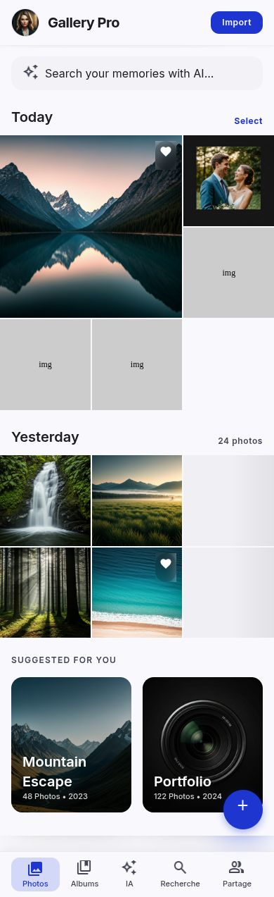
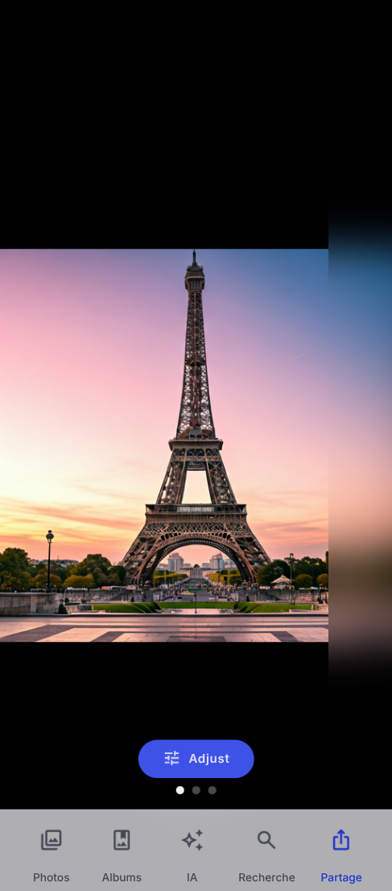
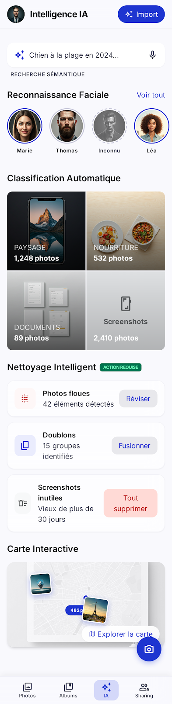

# 📸 Gallery Pro — Your Visual Legacy

> **A high-performance, mobile-first photo management suite.**  
> *Built for photographers, visual storytellers, and power users.*

[](https://www.netlify.com)
[](https://reactjs.org/)
[](https://www.typescriptlang.org/)
[](https://tailwindcss.com/)

---

## ✨ Features at a Glance

| Feature | Description | Status |
| :--- | :--- | :--- |
| **🖼 Immersive Gallery** | Ultra-smooth chronological photo wall with 2px gutters. | ✅ Done |
| **🎨 Advanced Editor** | Non-destructive adjustments (Brightness, Contrast, Saturation). | ✅ Done |
| **🧠 AI Intelligence** | Face recognition, smart cleaning, and semantic search UI. | ✅ Done |
| **🗺 Geolocation** | Interactive map view based on EXIF metadata. | ✅ Done |
| **📁 Collections** | Smart albums with multi-membership and stack previews. | ✅ Done |
| **📲 Seamless Import** | From Google Photos, Drive, SD Cards, or Local Files. | ✅ Done |

---

## 📱 Mobile-First Experience

Gallery Pro is designed with **"Invisible Utility"** — the interface recedes so your photography remains the protagonist.

### 🏠 Main Gallery
*Smooth scrolling, chronological grouping, and AI-driven search.*


### 🛠 Professional Editing
*Full non-destructive control over your image metadata.*


### 🧠 AI & Organization
*Smart cleaning, face recognition, and interactive maps.*


---

## 🛠 Tech Stack & Architecture

- **Core:** [React 18](https://reactjs.org/) + [Vite](https://vitejs.dev/)
- **Language:** [TypeScript](https://www.typescriptlang.org/)
- **Styling:** [Tailwind CSS](https://tailwindcss.com/)
- **State:** React Context API + Custom Hooks
- **Persistence:** LocalStorage (Mock Backend)
- **Deployment:** [Netlify](https://www.netlify.com/)

---

## 🚀 Quick Start

### 1️⃣ Clone & Install
```bash
git clone https://github.com/nouhailler/photorapp.git
cd photorapp
npm install
```

### 2️⃣ Run Development
```bash
npm run dev
```

### 3️⃣ Build for Production
```bash
npm run build
```

---

## 🎨 Design System: "Electric Indigo"

The app follows a strict design philosophy blending **Modern Minimalism** with **Glassmorphism**.

- **Primary Color:** `#1E35D0` (Electric Indigo)
- **Typography:** Inter (Utilitarian & Readable)
- **Elevation:** Backdrop blurs & ambient shadows
- **Corners:** 0.5rem base radius for accessible professional tone

---

## 🗺 Roadmap

- [ ] **Phase 6:** Real Cloud Backend integration (Supabase/Firebase).
- [ ] **Phase 7:** Real-time AI processing with Cloudinary.
- [ ] **Phase 8:** PWA support for offline management.
- [ ] **Phase 9:** Video support and playback.

---

## 🤝 Contributing

Contributions are welcome! Please read the `CONTEXT.md` for architectural guidance before submitting a Pull Request.

---
Built with ❤️ for the future of photography.
